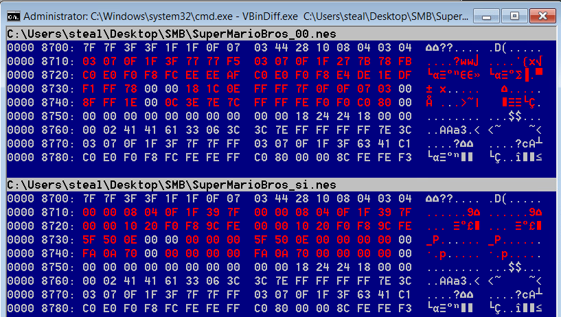

# hbv-nes
NES reverse engineering project for Host Based Vulnerability Discovery at UNO

## Proposal

For our semester project, we would like to reverse engineer an original Nintendo game, such as Super Mario Bros or Final Fantasy. As the NES uses the 6502 CPU, with a dramatically different processor architecture than x86, simply learning the new instructions and different methods of doing things should prove to be an interesting challenge. Fortunately, due to the hobbyist community, a significant amount of documentation exists to explain processor architecture, hardware, and file layouts. Numerous emulators have been created as well, with the most popular being FCEUX on Windows and OpenEmu on OSX.

We expect the actual project to consist of a mixture between simply analyzing and understanding the code in one of these games, and making some edits to the game ranging from trivial to complicated. Initial ideas include changing sprites and text (trivial), changing starting lives, score, and time (easy), modifying enemy behavior (medium/hard), or giving Mario new abilities like double jump (hard). Based on initial research, there are tools out there to easily edit graphics, but other editing usually requires a hex editor supplemented by an emulator’s debugger. For very popular games like Mario, numerous modified ROMs (known as ROMHacks) already exist and can be used for reference or additional inspiration.

Initial resources we’ve located include architecture reference for the 6052 at https://fms.komkon.org/EMUL8/NES.html, the community at https://www.romhacking.net/ and John Riggs’s YouTube tutorials on NES ROMhacking at https://www.youtube.com/playlist?list=PLsOTz-tlvayLmYmgreE4q1w0E6rN29T4p.

## ROMHacking

TODO: Some info about NES/ROM/ROMHacking

## What You'll Need

- an NES ROM
- an emulator/debugger
- a disassembler
- a hex editor
- patience

### Graphics Editing

Graphics editing is among the most trivial NES ROMHacking tasks. Graphical components of a game are defined in ROM as "tiles", which are 8x8 pixel grids that make up the game's background and sprites. At any one time, NES can render 512 tiles - 256 tiles reserved for each background and sprites.

Tiles may be composed of four colors, three of which are real colors rendered in-game, and the other transparent color for layering sprites in front of backgrounds.

Editing graphics is simple with tools like [Tile Layer Pro](https://www.romhacking.net/utilities/108/), which provides a GUI for navigating a game's tile palettes and modifying tiles pixel-by-pixel or in their entirety by copying other tiles (even tiles from other games).

The following shows the difference between an unmodified SMB ROM and one in which the Goomba was replaced with an alien from Space Invaders. The Goomba is composed of four tiles (one for each quadrant of the character) - notice that the binary change to ROM are to the four consecutive 16 byte tiles.

