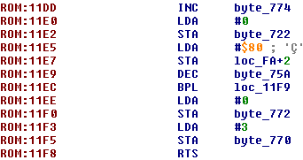

# hbv-nes
NES reverse engineering project for Host Based Vulnerability Discovery at UNO

## Proposal

For our semester project, we would like to reverse engineer an original Nintendo game, such as Super Mario Bros or Final Fantasy. As the NES uses the 6502 CPU, with a dramatically different processor architecture than x86, simply learning the new instructions and different methods of doing things should prove to be an interesting challenge. Fortunately, due to the hobbyist community, a significant amount of documentation exists to explain processor architecture, hardware, and file layouts. Numerous emulators have been created as well, with the most popular being FCEUX on Windows and OpenEmu on OSX.

We expect the actual project to consist of a mixture between simply analyzing and understanding the code in one of these games, and making some edits to the game ranging from trivial to complicated. Initial ideas include changing sprites and text (trivial), changing starting lives, score, and time (easy), modifying enemy behavior (medium/hard), or giving Mario new abilities like double jump (hard). Based on initial research, there are tools out there to easily edit graphics, but other editing usually requires a hex editor supplemented by an emulator’s debugger. For very popular games like Mario, numerous modified ROMs (known as ROMHacks) already exist and can be used for reference or additional inspiration.

Initial resources we’ve located include architecture reference for the 6052 at https://fms.komkon.org/EMUL8/NES.html, the community at https://www.romhacking.net/ and John Riggs’s YouTube tutorials on NES ROMhacking at https://www.youtube.com/playlist?list=PLsOTz-tlvayLmYmgreE4q1w0E6rN29T4p.

## History and Background

The history of ROM hacking, or the act of modifying a console game, is sadly not well documented. We can speculate that it likely existed in some form before the creation of emulators, but the community today simply would not exist without the ability to modify the code of a game and run it on a personal computer with no extra hardware. The [Wikipedia article](https://en.wikipedia.org/wiki/ROM_hacking) on the topic states that the majority of ROM hacking is done on NES and SNES games due to their size and relative simplicity. Emulation of the Nintendo Entertainment System, NES, or Famicom was first accomplished in 1990, though [the early history is rather fuzzy](https://emulation.gametechwiki.com/index.php/History_of_emulation#NES). Emulation gained in popularity in the late 90s as processor speeds increased, and today emulators can be found for virtually any commercial game system. While emulators for more modern systems like the Xbox 360 or PS4 are quite limited in their capabilities, those for older consoles such as the NES, Sega Genesis, or Atari 2600 are very full featured and capable. As a result of having capable emulators and data files for thousands of games, hobbyists have tinkered to create thousands of modified versions of games, featuring everything from simple modified sprites to whole new levels and even game mechanics. For this project, we have focused entirely on the NES and the original Super Mario Bros. (SMB) game.

The NES console itself uses the [MOS Technology 6502](https://en.wikipedia.org/wiki/MOS_Technology_6502) processor, which was also used in the Atari 2600, Apple II, several other popular devices in the early 1980s, and even Futurama's Bender. Fans of the console have created [impressive documentation](https://fms.komkon.org/EMUL8/NES.html) of its hardware, and [numerous tutorials](https://wiki.nesdev.com/w/index.php/Programming_guide) and [ebooks on 6502 assembly language](https://en.wikibooks.org/wiki/6502_Assembly) can be found, including a [JavaScript assembler and emulator](https://skilldrick.github.io/easy6502/).

While the NES originally used its iconic cartridges, the data from these games is now most typically packaged in the format used by the iNES emulator from the mid-90s. This format contains a [16-byte header](https://fms.komkon.org/EMUL8/NES.html#LABC) followed by a binary representation of the game's ROM and VROM banks. The header serves to identify the number of 16kB ROM banks and 8kB VROM banks, as well as how the file contents should be mapped by an emulator. In SMB the header indicates 2 ROM banks and 1 VROM bank for a total game size of 40kB, or approximately a bajillion and a half times smaller than one of today's blockbusters.

## What You'll Need

- an NES ROM
- an emulator/debugger
- a disassembler
- a hex editor
- patience

Fortunately, [FCEUX](http://fceux.com/web/home.html) can provide most of what is needed in this project, as it includes emulation, debugging, hex editing, and basic disassembly of ROM files, and runs on Windows, OS X, and *nix operating systems.

### Graphics Editing

Graphics editing is among the most trivial NES ROMHacking tasks. Graphical components of a game are defined in ROM as "tiles", which are 8x8 pixel grids that make up the game's background and sprites. At any one time, NES can render 512 tiles - 256 tiles reserved for each background and sprites.

Tiles may be composed of four colors, three of which are real colors rendered in-game, and the other transparent color for layering sprites in front of backgrounds.

Editing graphics is simple with tools like [Tile Layer Pro](https://www.romhacking.net/utilities/108/), which provides a GUI for navigating a game's tile palettes and modifying tiles pixel-by-pixel or in their entirety by copying other tiles (even tiles from other games).

The following shows the difference between an unmodified SMB ROM and one in which the Goomba was replaced with an alien from Space Invaders. The Goomba is composed of four tiles (one for each quadrant of the character) - notice that the binary change to ROM are to the four consecutive 16 byte tiles.

## Game Logic Editing

Modifying the behavior of a game is a more difficult task that requires making modifications to subroutines in ROM.

#TODO something about how annotated disassembly is invaluable for these modifications

An example of such a modification is removing a player's ability to lose lives upon dying. This can be achieved with the following procedure:

1) Identify the memory address that is used to store a player's remaining lives.
2) Locate the subroutine that handles player death.
3) Modify this subroutine such that it does not decrement a player's remaining lives and continues with normal game execution.

In the case of SMB, the life counter is stored at `RAM:75A` and is referenced by decrement in the subroutine that begins at `ROM:11DD`.

The decrement instruction at `ROM:11E9` can be replaced by `NOP` instructions to prevent loss of life. The instruction that follows, at `ROM:11EC`, results in a branch to `ROM:11F9` if the negative flag is clear which, under normal conditions, is true any time that the player has lost a life and has at least one life remaining. Because the negative flag is set at this point in the game's execution and not cleared by the preceeding NOP instructions, replacing the `BPL` with its inverse branch instruction, `BMI`, will ensure that the game continues to execute as though the player has lost a life and has at least one life remaining.

## Resources and References
* [Nintendo's Official Mario Page](https://mario.nintendo.com/)
* [NES Architecture](https://fms.komkon.org/EMUL8/NES.html)
* [FCEUX Emulator](http://fceux.com/web/home.html)
* [Romhacking.net Community](http://romhacking.net)
* [Super Mario Bros. Romhacking Wiki](https://datacrystal.romhacking.net/wiki/Super_Mario_Bros.)
* [Gametech Emulation Wiki](https://emulation.gametechwiki.com/index.php/Main_Page)
